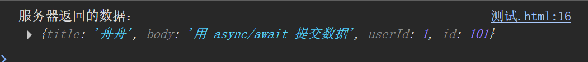

# Ajax
## axios
### 使用方法 ：
先引入axios库
```
<script src="https://cdn.jsdelivr.net/npm/axios/dist/axios.min.js"></script>
```
### 用axios发GET请求
```
axios.get('https://jsonplaceholder.typicode.com/users')
  .then(response => {
    console.log(response.data); // 返回的数据
    //这里就是写请求成功后需要执行的操作
  })
  .catch(error => {
    console.error('请求失败：', error);
  });
  ```
  #### 用async/await的写法写GET
  ```
  async function getUsers() {
  try {
    const response = await axios.get('https://jsonplaceholder.typicode.com/users');
    console.log(response.data);
  } catch (error) {
    console.error('出错了：', error);
  }
}

getUsers();
```
### 用axios发POST请求：向服务器提交数据
```
axios.post('https://jsonplaceholder.typicode.com/posts', {
  //这一部分就是写要提交的内容
  title: '舟舟',
  body: '你好，澈在教我学 Ajax！',
  userId: 1
})
.then(response => {
  console.log('服务器返回的数据：', response.data);
})
.catch(error => {
  console.error('提交失败：', error);
});
```
由于数据是JavaScript写的，所以axios会自动转换为JSON

运行结果：


#### 用async/await的写法写POST
```
async function sendPost() {
  try {
    const response = await axios.post('https://jsonplaceholder.typicode.com/posts', {
      title: '舟舟',
      body: '用 async/await 提交数据',
      userId: 1
    });
    console.log('服务器返回的数据：', response.data);
  } catch (error) {
    console.error('出错了：', error);
  }
}

sendPost();
```


#### POST请求一般用来：
* 提交表单（比如用户名，密码）
* 上传评论，文章，图片
* 向后端“写入”或“创建”新数据

### 请求头设置
#### 什么是请求头呢？
headers就行像你发请求时带的“附加信息”，比如：
* 你是谁（token）
* 你要发的数据是什么格式
* 告诉服务器你用什么语言，设备等（比如手机，PC）
#### 为什么要设置headers？
最常见的例子是：

> 登录后，后端给你一个 “token”（证明你是谁）
后面你再访问页面，就要在请求时带上这个 token
不然后端不知道你是谁，会拒绝你。

所以，我们需要在请求头里带上
`Authorization: 'Bearer 你的token'`
这里Bearer是一直身份验证方案，token是登录成功后后台会给的
```
axios.post('https://jsonplaceholder.typicode.com/posts', {
  title: '舟舟',
  body: 'CORS就像守门员',
  userId: 1
})
.then(res => console.log(res.data))
.catch(err => console.error(err));
```
res就是response，err就是error，只不过是简写
运行结果：


### 统一配置token
意义：不用每次都写headers
方法：设置全局默认headers
```
axios.defaults.headers.common['Authorization'] = 'Bearer 你的token';
```
加上这一句后面所有的axios请求都会自动带上这个token

```
// 假设登录成功后拿到了 token
const token = 'abc123xyz';

// 设置成全局默认值
axios.defaults.headers.common['Authorization'] = 'Bearer ' + token;

// 后面请求就不用再手动写 headers
axios.get('https://jsonplaceholder.typicode.com/users')
  .then(res => console.log(res.data));
```
小tip：
这个设置是全局的，页面刷新后就没有了，但是可以把token保存到浏览器的本地存储里面
```
localStorage.setItem('token', token); // 登录后保存
```
刷新后再读取
```
const token = localStorage.getItem('token');
axios.defaults.headers.common['Authorization'] = 'Bearer ' + token;
```

### 拦截器
#### 什么是拦截器？
拦截器就像是你在 axios 发送请求 / 接收响应的时候，加的“监听器”。

它可以：

* 在请求发出去之前做点事（比如自动加上 token）

* 在响应回来之后统一处理（比如统一判断是否登录过期）

#### 请求拦截器
```

// 设置请求拦截器
axios.interceptors.request.use(
  config => {
    // 从 localStorage 里取 token（你登录时保存过）
    const token = localStorage.getItem('token');

    // 如果有 token，就加到 headers 里
    if (token) {
      config.headers.Authorization = 'Bearer ' + token;
    }

    return config; // 一定要 return 回去，否则 axios 用不到
  },
  error => {
    return Promise.reject(error); // 如果出错就中断
  }
);
```
#### 拦截响应器（比如统一处理报错）
```
axios.interceptors.response.use(
  response => {
    // 所有成功响应都会先走这里
    return response;
  },
  error => {
    // 所有失败响应都会走这里
    if (error.response && error.response.status === 401) {
      alert('登录过期了，请重新登录');
      // 你也可以跳转登录页或清除 token
    }

    return Promise.reject(error);
  }
);
```
==!!!==
> axios.interceptors.request.use 是发出前的“拦截”
axios.interceptors.response.use 是收到响应后的“拦截”

基于此，阿澈给我写了一个可以统一处理各种错误的js文件
<a href="request.js"></a>


#### 清除拦截器

```
const requestInterceptor = request.interceptors.request.use(
  config => {
    console.log('请求拦截器');
    return config;
  },
  error => Promise.reject(error)
);

// 之后移除请求拦截器
request.interceptors.request.eject(requestInterceptor);
```
eject() 方法接受一个拦截器的 ID（在 use() 返回的就是该 ID），通过它可以移除特定的拦截器。

总结：拦截器的重要应用场景

1. 请求拦截器：

用于修改请求配置，比如添加 token、设置请求头。

在发送请求前检查某些条件，如用户是否登录。


2. 响应拦截器：

用于处理返回的数据，可以统一格式化数据。

对错误进行统一处理，如 401 错误跳转到登录页，或者显示提示。


3. 拦截器链：

拦截器是链式执行的，可以灵活组合多个拦截器，分别处理不同的需求。

4. 拦截器移除：

通过 eject() 方法可以移除某个拦截器，适用于需要动态控制拦截器的场景。

## XMLHttpRequest(XHR)
### XHR 是什么？
XMLHttpRequest（简称 XHR） 是浏览器提供的一个内建对象，可以用来向服务器发送请求、获取数据。
它是 Ajax 的核心，是最原始的异步请求方式。

虽然现在一般用 Axios 或 Fetch，但了解它的原理，可以让你更清楚请求到底是怎么一回事。

### 基础的XHR请求
```
const xhr = new XMLHttpRequest(); // 创建对象

xhr.open('GET', 'https://jsonplaceholder.typicode.com/users'); // 配置请求（类型、URL）

xhr.onreadystatechange = function () {
  if (xhr.readyState === 4) { // 请求完成
    if (xhr.status === 200) { // 请求成功
      const data = JSON.parse(xhr.responseText); // 把字符串变成对象
      console.log('用户数据：', data);
    } else {
      console.error('请求失败，状态码：', xhr.status);
    }
  }
};

xhr.send(); // 发送请求
```

逐行解释：

* new XMLHttpRequest()：创建一个请求对象。

* xhr.open()：设置请求方式和请求地址。

* xhr.onreadystatechange：监听请求状态的变化（类似 .then()）。

* xhr.readyState === 4：表示“请求完成”。

* xhr.status === 200：表示“成功拿到响应”。

* xhr.responseText：拿到的是 JSON 字符串，要 JSON.parse() 转为 JS 对象。

* xhr.send()：发出请求。


这里需要注意一下：XHR是没办法像axios那样子，返回所有内容，而是需要直接一步步去拼接

### 基本错误
（1）readyState：表示请求的状态。它有 5 个值（0-4）：

0: 请求未初始化（open() 没有被调用）

1: 服务器连接已建立（open() 被调用，但尚未发送请求）

2: 请求已发送（send() 被调用）

3: 请求处理中（接收到响应，但还在处理）

4: 请求已完成（响应处理完毕）

（2）status：表示 HTTP 请求的状态码，通常：

200：请求成功

404：找不到资源

500：服务器错误

### 基本错误处理
```
xhr.onreadystatechange = function () {
  if (xhr.readyState === 4) { // 请求完成
    if (xhr.status === 200) { // 请求成功
      const data = JSON.parse(xhr.responseText); // 转换数据
      console.log('获取数据成功：', data);
    } else {
      console.error('请求失败，状态码：', xhr.status);
      // 这里可以做更详细的错误处理
      if (xhr.status === 404) {
        alert('请求的资源未找到！');
      } else if (xhr.status === 500) {
        alert('服务器内部错误！');
      }
    }
  }
};
```
### 捕获网络错误
除了 HTTP 错误（如 404、500 等），我们还需要处理 网络错误，例如无法连接到服务器、网络中断等。这时 onerror 事件就派上用场了：
```
xhr.onerror = function () {
  console.error('网络错误，无法发送请求');
};
```

这样就可以捕获如网络中断、无法建立连接等错误。

### 超时处理
XMLHttpRequest 还提供了设置请求超时的功能。当请求超过指定时间仍未完成时，就会触发 ontimeout 事件。可以用于处理长时间没有响应的请求。

```
xhr.timeout = 5000; // 设置超时时间为 5 秒

xhr.ontimeout = function () {
  console.error('请求超时，请稍后再试');
};
```
如果设置了 xhr.timeout 属性，那么当请求超过这个时间仍未收到响应，ontimeout 事件会被触发。


### XHR发起POST请求
```
const xhr = new XMLHttpRequest();

xhr.open('POST', 'https://jsonplaceholder.typicode.com/posts'); // POST 请求

xhr.setRequestHeader('Content-Type', 'application/json'); // 告诉服务器这是 JSON 数据

xhr.onreadystatechange = function () {
  if (xhr.readyState === 4) {
    if (xhr.status === 201) {
      const data = JSON.parse(xhr.responseText); // 把返回的 JSON 字符串转为对象
      console.log('创建成功：', data);
    } else {
      console.error('请求失败，状态码：', xhr.status);
    }
  }
};

// 准备要发送的数据（对象）
const postData = {
  title: '舟舟',
  body: '我今天要学完XHR',
  userId: 1
};

xhr.send(JSON.stringify(postData)); // 转成 JSON 字符串发送
```

## fetch
### fetch 是什么
> fetch() 是浏览器原生提供的接口，用来发送 HTTP 请求（如 GET、POST 等），是 XMLHttpRequest 的升级版，更简洁、可读性更好，写法也更现代。

### 用fetch发起一个GET请求
```
fetch('https://jsonplaceholder.typicode.com/users')
  .then(response => response.json()) // 把响应解析为 JSON
  .then(data => {
    console.log('用户数据：', data);
  })
  .catch(error => {
    console.error('请求失败：', error);
  });
```
这里有没有发现有两个then
这是因为fetch() 是基于 Promise 的，而 Promise 可以通过链式调用 .then() 来一步一步处理数据。

### 用fetch发送POST请求
```
fetch('https://jsonplaceholder.typicode.com/posts', {
  method: 'POST', // 请求方式
  headers: {
    'Content-Type': 'application/json' // 请求头，告诉服务器我们发的是 JSON
  },
  body: JSON.stringify({
    title: '舟舟',
    body: '我饿了，但还是在学前端',
    userId: 1
  }) // 请求体（要发送的数据，必须是字符串）
})
  .then(response => response.json()) // 把响应转成 JSON
  .then(data => {
    console.log('创建成功：', data);
  })
  .catch(error => {
    console.error('出错了：', error);
  });
```
##### 发送 POST 的关键点：

要用 method: 'POST'

数据用 JSON.stringify()

记得加 Content-Type 请求头

### 用async/await写GET请求
```
async function getUsers() {
  try {
    const response = await fetch('https://jsonplaceholder.typicode.com/users');
    const data = await response.json(); // 把响应转成对象
    console.log('用户列表：', data);
  } catch (error) {
    console.error('请求出错了：', error);
  }
}

getUsers();
```

### 用async/await写POST请求
```
async function createPost() {
  try {
    const response = await fetch('https://jsonplaceholder.typicode.com/posts', {
      method: 'POST',
      headers: { 'Content-Type': 'application/json' },
      body: JSON.stringify({
        title: 'async/await',
        body: '写法好清爽！',
        userId: 1
      })
    });
    const data = await response.json();
    console.log('创建成功：', data);
  } catch (error) {
    console.error('出错了：', error);
  }
}

createPost();
```

## JSON
### JSON数据格式
```
{
  "name": "舟舟",
  "age": 20,
  "email": "zhouzhou@example.com"
}
```
JSON 既可以从外部获取（通过 API 请求），也可以通过 JavaScript 生成（通过 JSON.stringify()）发送到服务器。

### 解析JSON数据——JSON.parse
```
async function getUserData() {
  try {
    const response = await fetch('https://jsonplaceholder.typicode.com/users');
    const data = await response.json(); // 将 JSON 字符串解析成对象
    console.log('用户数据：', data);
  } catch (error) {
    console.error('请求失败：', error);
  }
}

getUserData();
```
response.json()这里没有用JSON.parse的原因是fetch返回的是对象，直接调用.json()
### 把对象转换为JSON——JSON.stringify()
适用情形：将JavaScript对象转换为JSON字符串，以便发送给服务器
```
const user = {
  name: '舟舟',
  age: 20,
  email: 'zhouzhou@example.com'
};

const jsonString = JSON.stringify(user); // 将对象转换为 JSON 字符串
console.log(jsonString);
```
## FormData
> FormData 是浏览器提供的一个类，用来方便地构建用于 POST 请求的表单数据，可以包含文本、文件等内容。
HTML:(模拟表单)
```
<form id="userForm">
  <input type="text" name="username" value="舟舟" />
  <input type="email" name="email" value="zhouzhou@example.com" />
  <button type="submit">提交</button>
</form>
```

JavaScript：(发送表单)
```
document.getElementById('userForm').addEventListener('submit', function(e) {
  e.preventDefault(); // 阻止默认提交行为

  const form = e.target;
  const formData = new FormData(form); // 自动收集表单内容

  fetch('https://jsonplaceholder.typicode.com/posts', {
    method: 'POST',
    body: formData // 直接放入 body
  })
    .then(res => res.json())
    .then(data => {
      console.log('服务器返回数据：', data);
      alert('提交成功！');
    })
    .catch(err => console.error('出错了：', err));
});
```
在这个代码里面，控制台只会打印id，因为FormData返回的是id，所以不会打印其他额外的内容

### 上传文件并显示进度
在 AJAX 请求中，上传文件通常会使用 XMLHttpRequest（XHR），因为它允许你追踪上传的进度。这对于上传大文件时非常有用，可以给用户显示上传进度条。

==关键点==：

1. 上传文件：使用 FormData 创建一个表单数据对象。


2. 显示进度：使用 XMLHttpRequest 的 progress 事件来获取上传进度。

```
<!DOCTYPE html>
<html lang="en">
<head>
    <meta charset="UTF-8">
    <meta name="viewport" content="width=device-width, initial-scale=1.0">
    <title>文件上传</title>
</head>
<body>
    <form id="uploadForm">
        <input type="file" id="fileInput" name="file" />
        <button type="submit">上传文件</button>
    </form>

    <div id="progressContainer">
        <label>上传进度：</label>
        <progress id="progressBar" value="0" max="100"></progress>
        <span id="progressPercent">0%</span>
    </div>

    <script>
        document.getElementById('uploadForm').addEventListener('submit', function(e) {
            e.preventDefault(); // 防止表单默认提交

            const fileInput = document.getElementById('fileInput');
            const file = fileInput.files[0]; // 获取文件

            if (!file) {
                alert('请选择一个文件!');
                return;
            }

            const formData = new FormData();
            formData.append('file', file); // 将文件添加到 FormData

            // 创建 XMLHttpRequest 对象
            const xhr = new XMLHttpRequest();

            // 监听上传进度
            xhr.upload.addEventListener('progress', function(e) {
                if (e.lengthComputable) {
                    const percent = Math.round((e.loaded / e.total) * 100); // 计算百分比
                    document.getElementById('progressBar').value = percent;
                    document.getElementById('progressPercent').textContent = `${percent}%`; // 更新进度百分比
                }
            });

            // 配置请求
            xhr.open('POST', 'https://jsonplaceholder.typicode.com/posts', true);

            // 发送请求
            xhr.send(formData);
        });
    </script>
</body>
</html>
```
代码解释：
1. 文件选择：用户通过 input[type="file"] 来选择文件。


2. FormData：用 FormData 对象把文件包装成可以发送的格式。


3. XMLHttpRequest：我们用 XMLHttpRequest 来创建一个异步请求，发送文件数据。


4. 上传进度：我们通过 xhr.upload.addEventListener('progress', function(e) {...}) 来监听文件上传的进度，并通过进度条和百分比更新 UI。


5. 发送请求：通过 xhr.send(formData) 发送请求。

##### 理解上传进度事件

xhr.upload.addEventListener('progress', ...) 是核心部分。它监听的是文件上传过程中的进度事件，回调函数中的 e 对象包含以下属性：

e.loaded：当前已上传的字节数。

e.total：文件的总字节数。

e.lengthComputable：如果为 true，表示可以计算进度。


通过这两个属性，我们可以计算出已上传的百分比，并将其显示在进度条和百分比文本中。

### 取消文件上传
#### 为什么要取消？
有时候，用户操作太快，请求还没完成就点击了别的地方：

比如搜索框快速输入，发送了多个请求；

或者点击按钮两次，发了重复请求；

如果不取消旧请求，就可能浪费带宽或显示过时数据。

### 用Axios实现取消请求
```const controller = new AbortController(); // 创建控制器
const signal = controller.signal; // 拿到 signal

axios.get('https://jsonplaceholder.typicode.com/users', { signal })
  .then(res => console.log('结果：', res.data))
  .catch(err => {
    if (axios.isCancel(err)) {
      console.warn('请求被取消了');
    } else {
      console.error('其他错误：', err);
    }
  });

// 某个时机触发取消（比如用户点了取消按钮）
setTimeout(() => {
  controller.abort(); // 取消请求
}, 100);
```
代码解释：
> AbortController 是浏览器内建的，用于中止异步操作（如 Fetch 或 Axios）。

>signal 是用来监听中止事件的对象，它会传给请求，让 axios 知道“可能会被取消”。

>`axios.get(..., { signal }) `把 signal 加进配置中。

>如果请求被取消了，会进入 .catch()。
>axios.isCancel(err) 可以判断是不是“取消请求”的错误。

完整代码
```
<!DOCTYPE html>
<html lang="en">
<head>
  <meta charset="UTF-8">
  <title>取消请求示例</title>
</head>
<body>
  <button id="startBtn">开始请求</button>
  <button id="cancelBtn">取消请求</button>

  <script src="https://cdn.jsdelivr.net/npm/axios/dist/axios.min.js"></script>
  <script>
    let controller = null;

    document.getElementById('startBtn').addEventListener('click', () => {
      controller = new AbortController(); // 创建控制器
      const signal = controller.signal;

      axios.get('https://jsonplaceholder.typicode.com/users', { signal })
        .then(res => {
          console.log('请求成功：', res.data);
          alert('获取成功！');
        })
        .catch(err => {
          if (axios.isCancel(err)) {
            console.warn('请求被取消了');
            alert('请求被取消了');
          } else {
            console.error('请求出错：', err);
            alert('请求失败');
          }
        });
    });

    document.getElementById('cancelBtn').addEventListener('click', () => {
      if (controller) {
        controller.abort(); // 调用取消
      }
    });
  </script>
</body>
</html>
```


### 用Fetch手动终止请求
```
const controller = new AbortController();
const signal = controller.signal;

fetch('https://jsonplaceholder.typicode.com/users', { signal })
  .then(res => res.json())
  .then(data => console.log('数据：', data))
  .catch(err => {
    if (err.name === 'AbortError') {
      console.warn('Fetch 请求被取消');
    } else {
      console.error('其他错误：', err);
    }
  });

setTimeout(() => {
  controller.abort(); // 100ms 后取消请求
}, 100);
```
